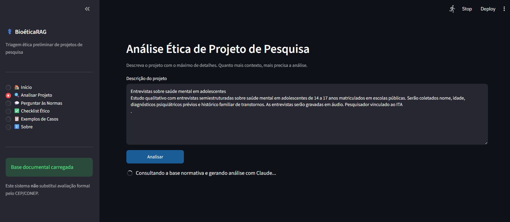
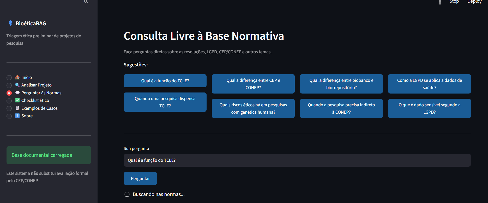
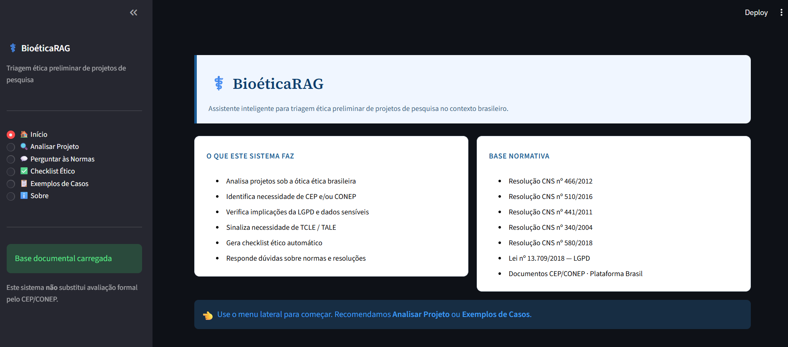
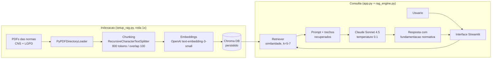

# ⚕️ BioéticaRAG

> **Assistente inteligente para triagem ética preliminar de projetos de pesquisa**, fundamentado nas Resoluções do Conselho Nacional de Saúde (CNS) e na LGPD.




---

## 📌 Sobre o projeto

O **BioéticaRAG** é uma aplicação **RAG (Retrieval-Augmented Generation)** que ajuda pesquisadores a fazer uma **triagem ética preliminar** de projetos antes da submissão ao Comitê de Ética em Pesquisa (CEP). O sistema recupera trechos relevantes das normas brasileiras de ética em pesquisa e usa o **Claude (Anthropic)** para produzir análises fundamentadas, sempre citando a fonte normativa.

A base documental cobre as principais resoluções do CNS (466/2012, 510/2016, 441/2011, 340/2004, 580/2018) e a **LGPD** (Lei 13.709/2018).

### Funcionalidades

- **Análise de projeto** — recebe a descrição de uma pesquisa e retorna uma avaliação ética estruturada
- **Consulta livre** — responde perguntas sobre as normas com citação das fontes recuperadas
- **Checklist ético** — gera critérios de conformidade a partir da descrição do projeto

### Demonstração

Análise ética a partir da descrição de um projeto — o sistema consulta a base normativa e gera o parecer com o Claude:



Consulta livre às normas, com sugestões prontas e busca sobre as resoluções indexadas:



---

## 🏗️ Arquitetura



**Fluxo resumido:** os PDFs são carregados, divididos em chunks e vetorizados uma única vez, ficando persistidos no Chroma. A cada consulta, o retriever busca os trechos mais relevantes por similaridade e os injeta no prompt do Claude, que responde ancorado nas normas — reduzindo alucinação e permitindo rastrear a fonte.

### Componentes

| Arquivo | Responsabilidade |
|---|---|
| `app.py` | Interface Streamlit (análise, consulta livre, checklist) |
| `rag_engine.py` | Motor RAG: retriever, prompts e integração com o Claude |
| `setup_rag.py` | Indexação dos PDFs no banco vetorial (executa uma vez) |
| `docker-compose.yml` | Orquestra os serviços `setup` (indexa) e `app` (serve) |
| `Dockerfile` | Imagem Python 3.11 com todas as dependências |

---

## 🚀 Como rodar

### Opção A — Docker (recomendado)

**Pré-requisitos:** Docker + Docker Compose e as chaves de API.

```bash
# 1. Clone o repositório
git clone https://github.com/SEU-USUARIO/bioetica-rag.git
cd bioetica-rag

# 2. Configure as chaves de API
cp .env.example .env
# edite .env e preencha ANTHROPIC_API_KEY e OPENAI_API_KEY

# 3. Suba tudo
docker compose up --build
```

Acesse **http://localhost:8570** no navegador.

O que acontece automaticamente:
1. A imagem é construída com todas as dependências.
2. O serviço `setup` verifica se o `chroma_db/` está vazio e indexa os PDFs se necessário.
3. O serviço `app` sobe o Streamlit assim que a indexação termina.

**Comandos úteis:**

```bash
docker compose up --build -d          # subir em background
docker compose logs -f app            # acompanhar logs
docker compose down                   # parar tudo
docker compose down -v                # parar e apagar o banco vetorial
```

### Opção B — Local (sem Docker)

```bash
pip install -r requirements.txt
cp .env.example .env          # preencha as chaves
python setup_rag.py           # indexa os PDFs (uma vez)
streamlit run app.py          # inicia a interface
```

---

## 🔑 Variáveis de ambiente

| Chave | Para quê | Modelo |
|---|---|---|
| `ANTHROPIC_API_KEY` | Geração de texto (LLM) | `claude-sonnet-4-5` |
| `OPENAI_API_KEY` | Embeddings (vetorização) | `text-embedding-3-small` |

> O Claude não oferece API de embeddings, por isso a vetorização usa o `text-embedding-3-small` da OpenAI — o modelo mais barato disponível. A indexação completa custa menos de US$ 0,01.

---

## 💰 Custo estimado de API

| Operação | Tokens aprox. | Custo |
|---|---|---|
| Análise completa | ~3.000 | ~US$ 0,015 (Claude) |
| Consulta livre | ~1.500 | ~US$ 0,008 (Claude) |
| Checklist | ~1.200 | ~US$ 0,006 (Claude) |
| Indexação (uma vez) | ~500k embeddings | ~US$ 0,01 (OpenAI) |

---

## 🛠️ Stack técnica

**Python 3.11** · **Streamlit** (interface) · **LangChain** (orquestração RAG) · **Chroma DB** (banco vetorial) · **Claude Sonnet 4.5** (LLM) · **OpenAI Embeddings** · **Docker Compose** (deploy).

---

## ⚠️ Limitações

- **Não substitui** a avaliação formal pelo CEP/CONEP.
- Não constitui parecer jurídico definitivo.
- A qualidade das respostas depende dos documentos indexados.
- Casos complexos exigem análise presencial com especialista.

---

## 📄 Licença

Distribuído sob a licença MIT. As normas em `docs/` são documentos públicos do CNS e da legislação brasileira.

**Fontes oficiais:**
- Resoluções CNS: https://conselho.saude.gov.br/resolucoes
- LGPD (Lei 13.709/2018): https://www.planalto.gov.br/ccivil_03/_ato2015-2018/2018/lei/l13709.htm
